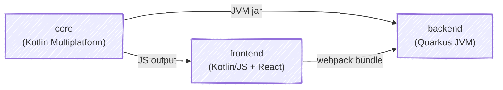
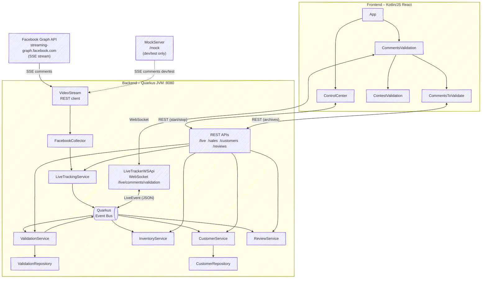
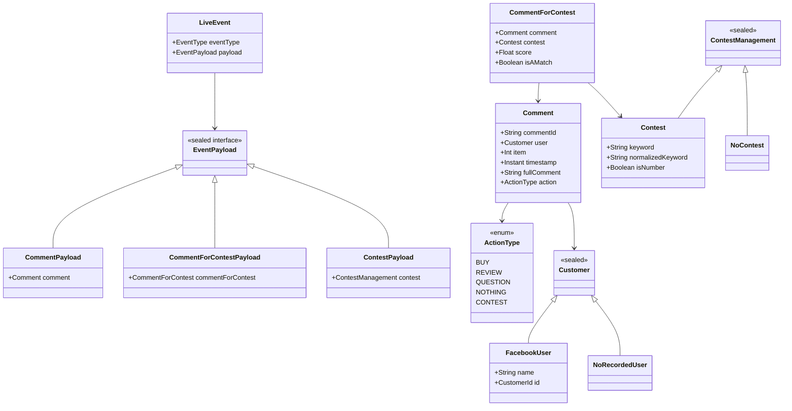
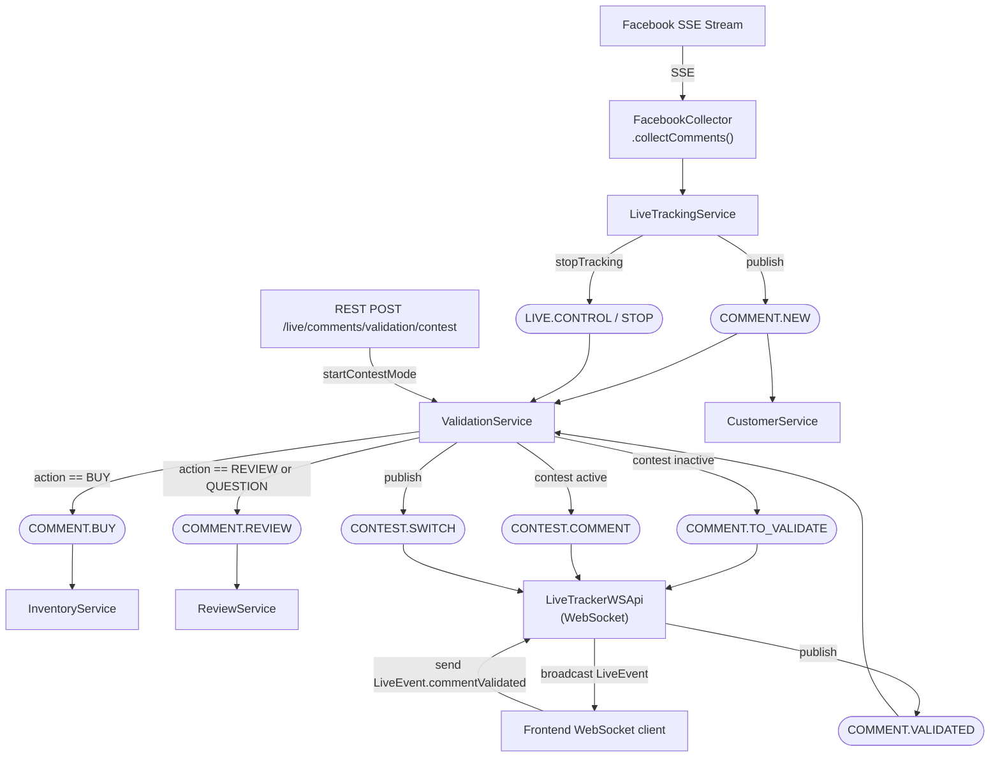
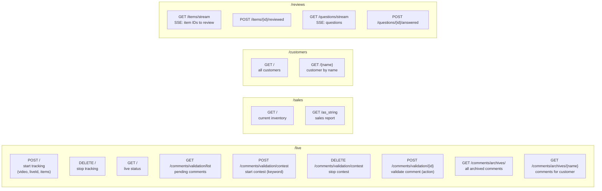
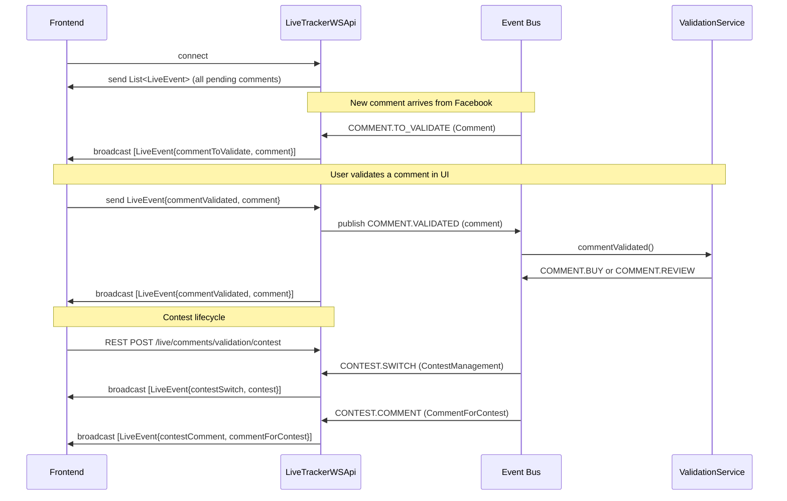
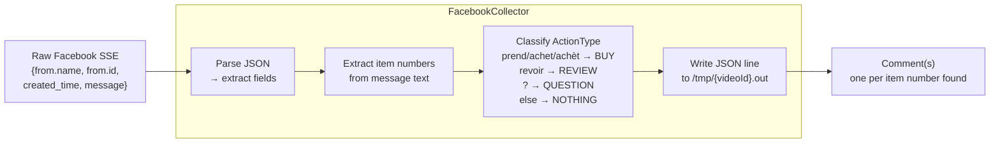
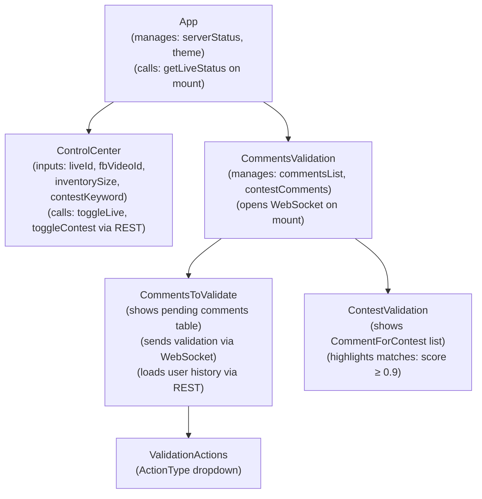
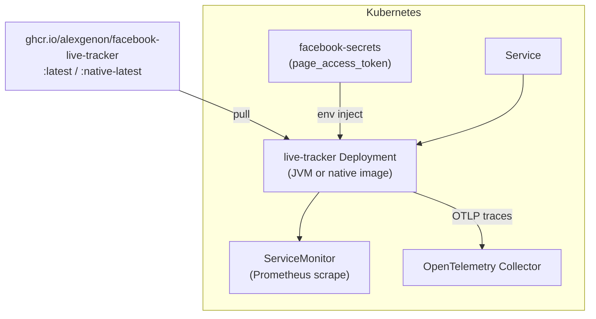

# Architecture

## Module Structure

The project is a Kotlin Multiplatform monorepo with three Gradle modules. The build order is strict: `core` is compiled first (to JVM and JS), `frontend` consumes the JS output, and `backend` bundles the frontend's webpack output into its own resources.

---

## High-Level Component Overview

---

## Domain Model

---

## Event Bus Message Flow

The Quarkus Event Bus is the primary internal communication mechanism. All event names are string constants defined in `LiveEvent`.

---

## REST API

---

## WebSocket Protocol

The single WebSocket endpoint (`/live/comments/validation`) carries `LiveEvent` objects serialized as JSON.

---

## Comment Processing Pipeline

When a comment contains multiple item numbers (e.g., "je prends 3 et 7"), one `Comment` is produced per number, each with a different `item` value.

---

## Frontend Component Tree

---

## Deployment

Docker images are built by the `build_and_release.yml` GitHub Actions workflow on each GitHub Release, targeting `linux/amd64` and `linux/arm64`.

---

## Technology Stack Summary

| Layer | Technology |
|---|---|
| Language | Kotlin 1.6.21 (JVM + JS multiplatform) |
| Backend framework | Quarkus 2.11.1 |
| Reactive streams | Mutiny (`Multi<T>`) |
| Internal messaging | Quarkus Event Bus (Vert.x) |
| HTTP client (Facebook) | Quarkus REST Client Reactive |
| WebSocket (server) | `quarkus-websockets` (JSR-356) |
| Serialization | `kotlinx-serialization-json` |
| Frontend UI | React 18 + Material-UI 5 (Kotlin/JS wrappers) |
| CSS-in-JS | Emotion |
| HTTP client (frontend) | Browser `fetch` / `WebSocket` |
| Build | Gradle 7.5.1 |
| Container registry | GitHub Container Registry (`ghcr.io`) |
| Observability | Micrometer + Prometheus, OpenTelemetry (OTLP) |
